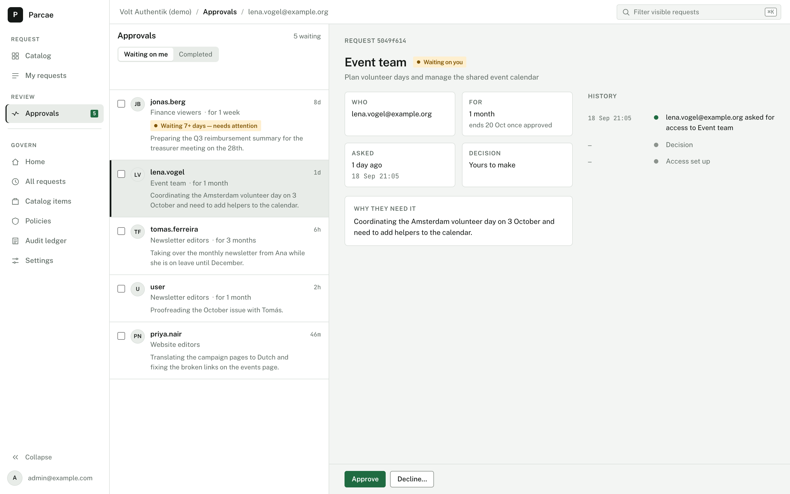
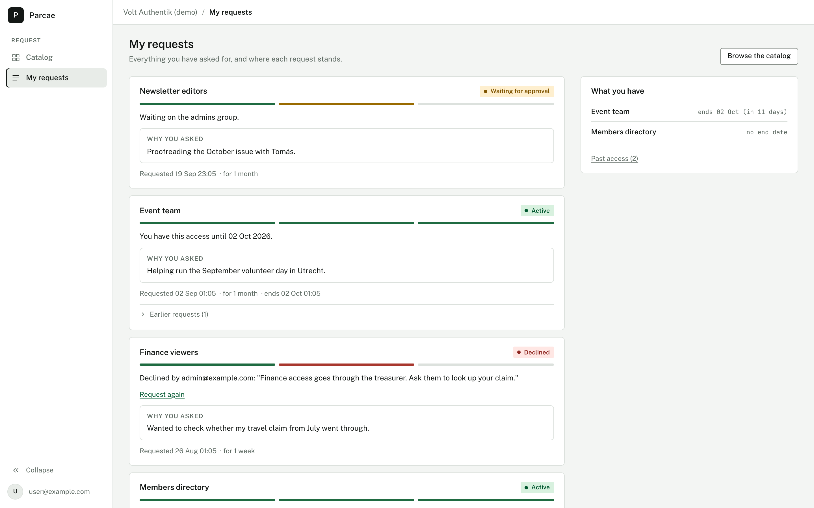

# Parcae

> **Source, issues and pull requests live on tangled:** https://tangled.org/tielbeke.io/parcae
> This GitHub repository is a read-only landing page that publishes the container image
> `ghcr.io/antoinetielbeke/parcae`. It accepts no contributions.

Open-source Identity Governance & Administration (IGA) layer for self-hosted
OIDC identity providers (Authentik, Keycloak).

Users browse a requestable catalog, request access with justification,
approvers review, Parcae provisions the group membership automatically — with
time-bounded grants, automatic expiry, retry with backoff, webhook
notifications, and a DB-enforced append-only audit trail.

Name origin: the Roman Fates — Nona (grants), Decima (reviews), Morta (revokes).

## What it looks like

The approver's docket: waiting requests on the left, the selected request's
facts, reason and history on the right, Approve and Decline always in view.



The requester's view: each request as a card with a three-step progress bar
and one plain sentence, and "What you have" listing current access and when
it ends.



Both shots come from the demo data in `scripts/seed-demo.sql` (local dev
database only; it replaces requests and catalog items).

## Features

- **OIDC login** via your existing IdP (Authentik, Keycloak, ...) — PKCE, encrypted cookie sessions
- **Group sync** — periodic + on-demand sync of groups from the IdP admin API
- **Access catalog** — admin curates which groups are requestable (ADR-002: synced, never live-queried)
- **Access requests** — users pick an item, give a justification, track status
- **Approval workflow** — request routes to a configured approver (sub / email / group); self-approval prevented
- **Auto-provisioning** — approved requests add the user to the IdP group; failures retry with 1m/5m/30m backoff, then admins can retry manually
- **Time-bounded grants** — optional max duration per catalog item; expired grants are auto-revoked
- **Audit trail** — append-only, enforced by a dedicated INSERT-only Postgres role (ADR-003)
- **Webhooks** — lifecycle events POSTed as JSON to one global endpoint
- **Formal state machine** — every transition validated and DB-enforced (ADR-004)

## Quickstart (Docker Compose)

```bash
git clone https://tangled.org/tielbeke.io/parcae && cd parcae
cp .env.example .env   # then set PARCAE_AUTH_ISSUER + PARCAE_OIDC_CLIENT_SECRET
make up                # builds and starts Postgres + Parcae
open http://localhost:8080
```

Register an OIDC client in your IdP with redirect URI
`http://localhost:8080/auth/callback`, and create the IdP connection in the
admin UI (Settings → Identity provider, `/admin/settings`) using the IdP's admin API credentials.

## Development

Requires Go 1.27+, templ, golangci-lint, Docker.

```bash
make build        # build bin/parcae (runs templ-generate first)
make run          # run locally (needs parcae.yaml; listens on :8080)
make test         # run tests (-race)
make test-integration  # integration tests vs ephemeral Postgres 17
make lint         # golangci-lint
make fmt          # gofmt
make docker       # build Docker image (parcae:dev)
make up / down    # compose quickstart stack
```

Config is YAML with `${VAR}` env substitution — copy
[deploy/parcae.example.yaml](deploy/parcae.example.yaml) to `parcae.yaml`
or point `PARCAE_CONFIG` at it. All configuration options are documented in
[docs/architecture/deployment.md](docs/architecture/deployment.md).

`GET /healthz` returns `{"status":"ok"}`.

## Architecture & docs

- [Architecture overview](docs/architecture/overview.md)
- [Data model](docs/architecture/data-model.md)
- [Request state machine](docs/architecture/state-machine.md)
- [Connector interface](docs/architecture/connector-interface.md)
- [Security model](docs/architecture/security.md)
- [Architecture decisions (ADRs)](docs/decisions/)
- [MVP scope](docs/roadmap/mvp-scope.md) · [Roadmap](docs/roadmap/expansion-phases.md)

## License

AGPL-3.0-or-later — see [LICENSE](LICENSE).

## Container image

```bash
docker pull ghcr.io/antoinetielbeke/parcae:latest
```

Built from `deploy/Dockerfile` on tangled; a European registry copy is planned as the canonical location.
